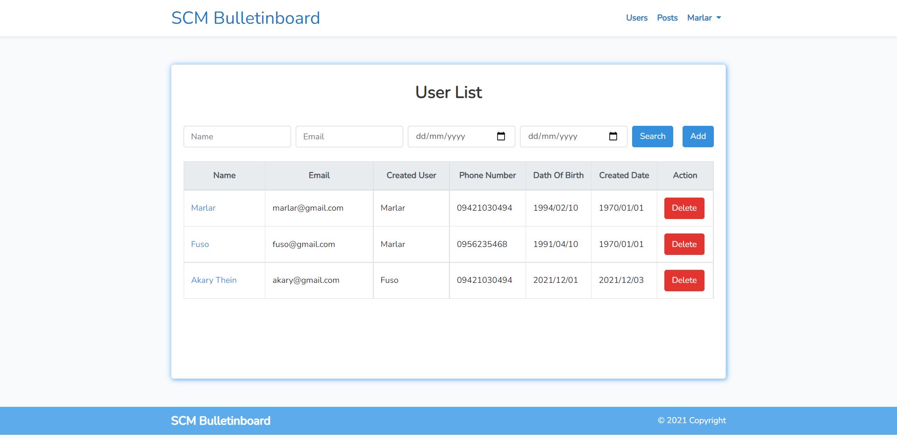
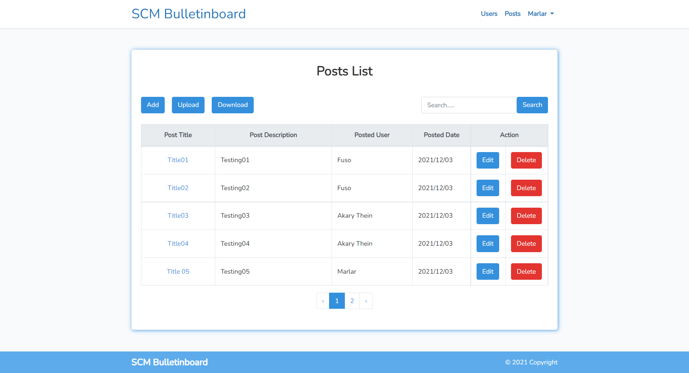
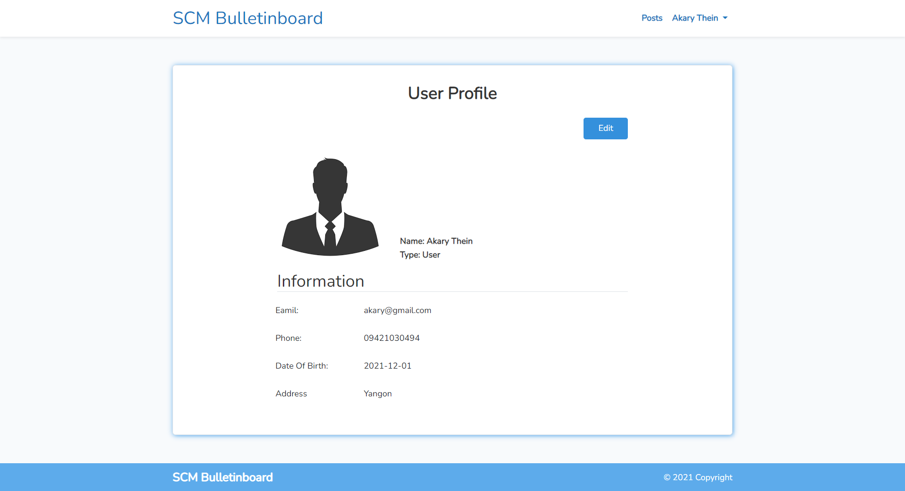

# BulletinBoard Project

## Requirements

- PHP 7.4
- Apache 
- MySQL 8.0.27
- Composer 2.1.9
- Laravel 7

## Installation

Please check the official laravel installation guide for server requirements before you start.
[Official Documentation](https://laravel.com/docs/7.x)

Clone the repository
```
git clone https://github.com/Myint-Marlar-Wai/bulletinboard.git
```
Switch to the repo folder
```
cd bulletinboard
```
Install all the dependencies using composer
```
composer install
```
Copy the example env file and make the required configuration changes in the .env file
```
cp .env.example .env
```
Generate a new application key
```
php artisan key:generate
```
Run the database migrations (Set the database connection in .env before migrating)
```
php artisan migrate
```
Run the database seeder 
```
php artisan db:seed
```
Start the local development server
```
php artisan serve
```
You can now access the server at http://localhost:8000 and login using this email and password for admin.

```
Email : marlar@gmail.com
Password : M@rlar12345
```

## Features

- [Users](#Users)
  - Admin Role(Can manage the all users)
  - User Role(Can Edit only self data)
- [Posts](#Posts)
  - Admin Role(Can manage the all posts)
  - User Role(Can manage only my post)
-  [User Profile](#Profile)
  - Admin Role(Can manage all user profile)
  - User Role(Can manage only my profile)


## Users



## Posts



## Profile



